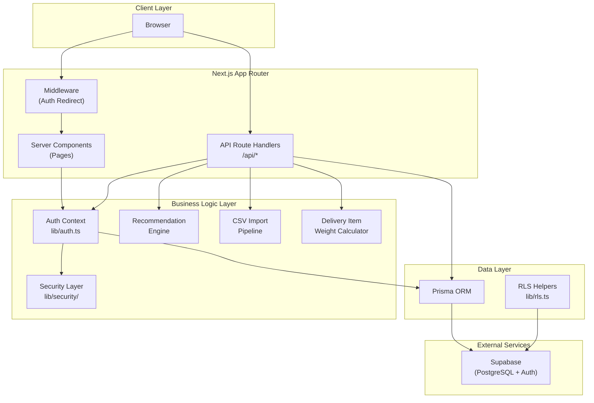
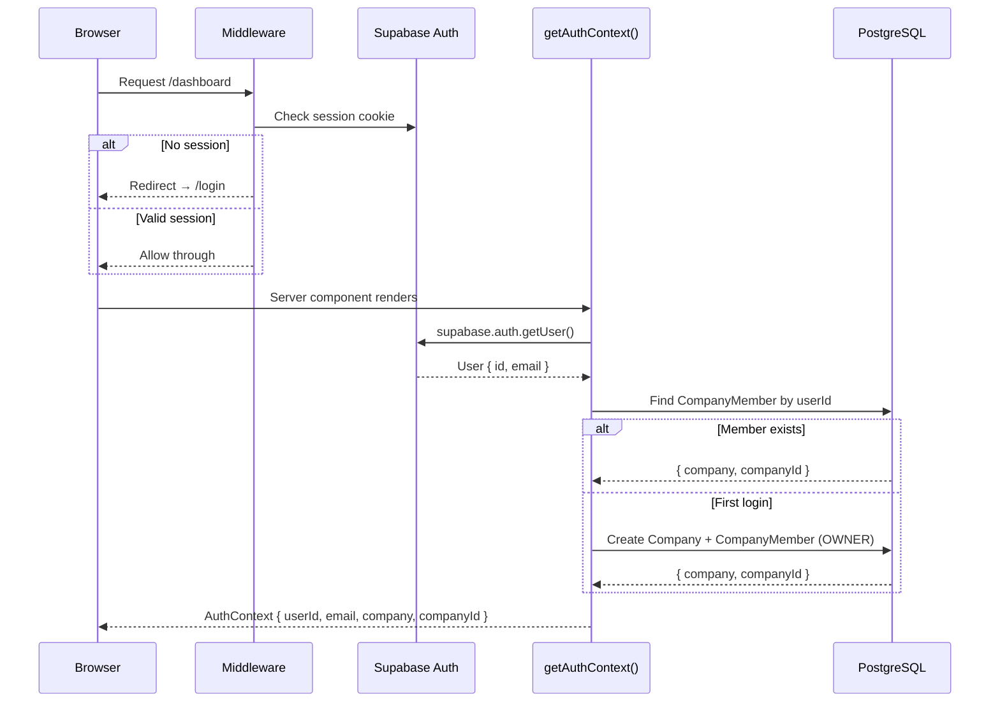
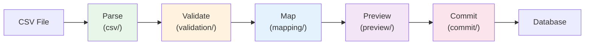
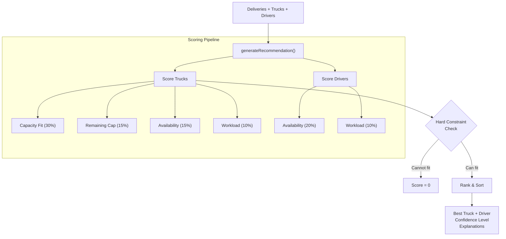

# Architecture

## System Overview

LoadFlow is a multi-tenant logistics SaaS application. Each tenant (company) has complete data isolation — a user can only see and modify data belonging to their company.



## Authentication Flow



Every API route and server component calls `getAuthContext()` to:
1. Verify the user has a valid Supabase session
2. Resolve which company the user belongs to
3. Return a `companyId` used to scope all subsequent database queries

## Tenant Isolation

All database queries are scoped by `companyId`. This is enforced at three levels:

1. **Application Layer**: Every Prisma query includes `where: { companyId }` as a mandatory filter.
2. **Security Helpers**: `validatePathId()` ensures path parameters are valid UUIDs. `assertOwnership()` verifies a record belongs to the requesting company.
3. **Database Layer**: PostgreSQL Row Level Security (RLS) policies are defined in `prisma/rls/` as a defense-in-depth measure.

## Module Architecture

### Core Modules

| Module | Location | Purpose |
|--------|----------|---------|
| Auth | `lib/auth.ts` | Session verification, company resolution, auto-provisioning |
| Security | `lib/security/` | UUID validation, tenant ownership assertions, error responses |
| Prisma | `lib/prisma.ts` | Database client singleton |
| RLS | `lib/rls.ts` | Row Level Security query helpers |
| Constants | `lib/constants.ts` | Shared business constants |
| Utils | `lib/utils.ts` | Generic utilities (`cn()` for class names) |
| Types | `types/index.ts` | Shared TypeScript interfaces and enums |

### Business Domain Modules

| Module | Location | Purpose |
|--------|----------|---------|
| Deliveries | `app/api/deliveries/`, `components/deliveries/` | CRUD, status lifecycle, item management |
| Trucks | `app/api/trucks/`, `components/trucks/` | CRUD, status tracking, capacity management |
| Drivers | `app/api/drivers/`, `components/drivers/` | CRUD, availability tracking |
| Load Plans | `app/api/loads/`, `components/loads/` | Plan creation, delivery assignment, dispatch lifecycle |
| Recommendations | `lib/services/recommendation-engine.ts`, `app/api/recommendations/` | Deterministic truck/driver scoring |
| CSV Import | `lib/import/` | Multi-stage import pipeline |
| Delivery Items | `lib/delivery-items.ts` | Item-level weight computation |

### CSV Import Pipeline

The import pipeline processes CSV files through six sequential stages:



Each stage is a pure engine with its own test suite. The orchestrator (`pipeline/engine.ts`) runs them in sequence and produces diagnostics at each stage.

| Stage | Engine | Tests | Purpose |
|-------|--------|-------|---------|
| Parse | `csv/parser.ts` | 100+ rows/sec | Parse CSV text into structured rows |
| Validate | `validation/engine.ts` | Field-level | Validate required fields, types, formats |
| Map | `mapping/engine.ts` | Column matching | Map CSV columns to delivery domain fields |
| Preview | `preview/engine.ts` | Diff engine | Classify rows as create/update/skip with field diffs |
| Commit | `commit/engine.ts` | Transactional | Write to database with rollback support |

### Recommendation Engine



The engine is pure computation — no database access, no side effects. The API route (`/api/recommendations`) handles data fetching and passes pre-transformed data to the engine.

## Server/Client Boundary

| Layer | Rendering | Purpose |
|-------|-----------|---------|
| `app/(dashboard)/*/page.tsx` | Server | Auth check, data fetching, page shell |
| `components/*/` | Client (`'use client'`) | Interactive UI, forms, state management |
| `app/api/*/route.ts` | Server | REST endpoints, business logic |
| `lib/services/` | Server | Pure business logic (no React) |
| `lib/import/` | Server | Pipeline engines (no React) |

## Data Flow

All data flows through this pattern:

```
Browser → API Route → getAuthContext() → Prisma (scoped by companyId) → PostgreSQL
```

For server components:

```
Browser → Server Component → getAuthContext() → Prisma (scoped by companyId) → PostgreSQL → Render HTML
```

## Dependency Direction

```
Pages → Components → UI Components
  ↓
API Routes → Business Logic (services, import) → Prisma → Database
  ↓
Auth + Security (cross-cutting)
```

Dependencies flow inward. Business logic never imports from React components. The recommendation engine and import pipeline have zero React dependencies.
