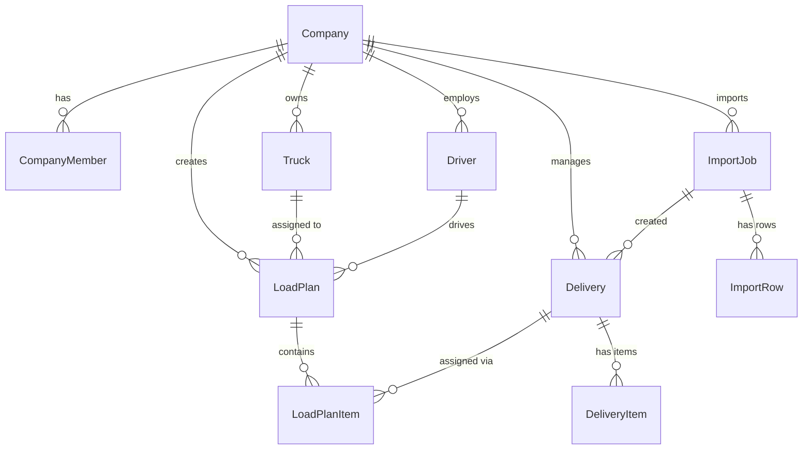

# Database Schema

## Overview

LoadFlow uses PostgreSQL (hosted on Supabase) with Prisma ORM. The schema is defined in `prisma/schema.prisma`. All table names use `snake_case` via `@@map()` directives while Prisma models use `PascalCase`.

## Entity Relationship Diagram



## Tenant Boundary

Every business entity includes a `companyId` foreign key. This is the primary mechanism for tenant isolation:

```
Company (root)
├── Truck          (companyId → Company.id)
├── Driver         (companyId → Company.id)
├── Delivery       (companyId → Company.id)
├── LoadPlan       (companyId → Company.id)
└── ImportJob      (companyId → Company.id)
```

`CompanyMember` links Supabase Auth users (`userId`) to companies. A user can belong to one company. The `getAuthContext()` function resolves `userId → companyId` on every request.

## Core Entities

### Company (`companies`)

The tenant root. Stores organization settings and user profile data.

| Column | Type | Description |
|--------|------|-------------|
| `id` | UUID | Primary key (auto-generated) |
| `name` | String | Company display name |
| `full_name` | String | Owner's full name |
| `display_name` | String | Owner's display name |
| `phone` | String | Contact phone |
| `timezone` | String | Default: `America/Chicago` |
| `units` | String | `imperial` or `metric` |
| `email_notifications` | Boolean | Default: `true` |
| `dispatch_alerts` | Boolean | Default: `true` |
| `weekly_report` | Boolean | Default: `false` |

### CompanyMember (`company_members`)

Links Supabase Auth users to companies with role-based access.

| Column | Type | Description |
|--------|------|-------------|
| `company_id` | UUID FK | References `companies.id` (CASCADE delete) |
| `user_id` | UUID | Supabase Auth user ID |
| `role` | Enum | `OWNER`, `ADMIN`, or `MEMBER` |

**Unique constraint:** `(company_id, user_id)` — a user can only be in a company once.

**Index:** `user_id` — fast lookup during auth context resolution.

### Truck (`trucks`)

Vehicles available for deliveries.

| Column | Type | Description |
|--------|------|-------------|
| `id` | UUID | Primary key |
| `company_id` | UUID FK | Tenant scope |
| `name` | String | Display name (e.g., "Heavy Hauler") |
| `type` | String | Vehicle type (default: "Box Truck") |
| `plate_number` | String | License plate |
| `weight_capacity` | Float | Maximum weight in kg |
| `status` | Enum | `AVAILABLE`, `IN_USE`, `MAINTENANCE` |
| `is_archived` | Boolean | Soft delete flag |
| `archived_at` | DateTime? | Timestamp of archival |
| `notes` | String? | Free-text notes |

**Index:** `(company_id, is_archived)` — efficient list queries.

### Driver (`drivers`)

Personnel who operate trucks.

| Column | Type | Description |
|--------|------|-------------|
| `id` | UUID | Primary key |
| `company_id` | UUID FK | Tenant scope |
| `name` | String | Full name |
| `phone` | String? | Contact number |
| `license_number` | String? | License identifier |
| `status` | Enum | `AVAILABLE`, `ON_TRIP`, `OFF_DUTY` |
| `is_archived` | Boolean | Soft delete flag |

**Index:** `(company_id, is_archived)`.

### Delivery (`deliveries`)

Individual delivery orders from customers.

| Column | Type | Description |
|--------|------|-------------|
| `id` | UUID | Primary key |
| `company_id` | UUID FK | Tenant scope |
| `customer_name` | String | Customer identifier |
| `pickup_address` | String | Origin address |
| `delivery_address` | String | Destination address |
| `weight` | Decimal(12,4) | Total weight in kg |
| `status` | Enum | `PENDING` → `ASSIGNED` → `IN_TRANSIT` → `DELIVERED` / `CANCELLED` |
| `scheduled_date` | DateTime? | Target delivery date |
| `external_id` | String? | External system reference |
| `source` | Enum | How it was created: `MANUAL`, `CSV`, `EXCEL`, `API`, etc. |
| `source_reference` | String? | Reference in external system |
| `import_job_id` | UUID? FK | Link to import job that created it |
| `is_archived` | Boolean | Soft delete flag |

**Indexes:**
- `(company_id, is_archived)` — list queries
- `(company_id, status)` — filtered list queries
- `(company_id, external_id)` UNIQUE — prevent duplicate imports
- `(import_job_id)` — find deliveries from an import

### DeliveryItem (`delivery_items`)

Line items within a delivery (e.g., individual products).

| Column | Type | Description |
|--------|------|-------------|
| `id` | UUID | Primary key |
| `delivery_id` | UUID FK | Parent delivery (CASCADE delete) |
| `product_name` | String | Product identifier |
| `sku` | String? | Stock keeping unit |
| `quantity` | Decimal(12,4) | Quantity ordered |
| `quantity_unit` | String | Unit label (default: "cartons") |
| `unit_type` | Enum | `STANDARD_WEIGHT`, `VARIABLE_WEIGHT`, `PIECE_BASED` |
| `unit_weight` | Decimal(12,4)? | Weight per unit (null for variable) |
| `total_weight` | Decimal(12,4) | Computed total weight for this line |
| `sort_order` | Int | Display ordering |

Weight computation depends on `unit_type`:
- `STANDARD_WEIGHT`: `total_weight = quantity × unit_weight`
- `VARIABLE_WEIGHT`: `total_weight` provided directly
- `PIECE_BASED`: `total_weight = quantity × unit_weight` (or direct)

### LoadPlan (`load_plans`)

Associates a truck and optional driver with a set of deliveries for a specific date.

| Column | Type | Description |
|--------|------|-------------|
| `id` | UUID | Primary key |
| `company_id` | UUID FK | Tenant scope |
| `truck_id` | UUID FK | Assigned truck (RESTRICT delete) |
| `driver_id` | UUID? FK | Assigned driver (RESTRICT delete) |
| `status` | Enum | `DRAFT` → `READY` → `DISPATCHED` → `COMPLETED` |
| `date` | DateTime | Planned execution date |
| `notes` | String? | Free-text notes |

**Indexes:**
- `(company_id, date)` — date-based queries
- `(company_id, status)` — status filters

**Delete behavior:** Truck and driver use `RESTRICT` — cannot delete a truck/driver with active load plans.

### LoadPlanItem (`load_plan_items`)

Junction table linking load plans to deliveries with ordering.

| Column | Type | Description |
|--------|------|-------------|
| `load_plan_id` | UUID FK | Parent load plan (CASCADE delete) |
| `delivery_id` | UUID FK | Assigned delivery |
| `sort_order` | Int | Delivery sequence within the plan |

**Unique constraint:** `(load_plan_id, delivery_id)` — a delivery can only appear once per plan.

### ImportJob (`import_jobs`)

Tracks CSV file import operations.

| Column | Type | Description |
|--------|------|-------------|
| `id` | UUID | Primary key |
| `company_id` | UUID FK | Tenant scope |
| `filename` | String? | Original filename |
| `source_type` | Enum | `CSV`, `EXCEL`, `API`, etc. |
| `status` | Enum | `QUEUED` → `PARSING` → `MAPPING` → `VALIDATING` → `READY_FOR_REVIEW` → `IMPORTING` → `COMPLETED` / `FAILED` / `CANCELLED` / `ROLLED_BACK` |
| `uploaded_by` | UUID | Supabase Auth user who initiated |
| `started_at` | DateTime? | Processing start |
| `completed_at` | DateTime? | Processing end |
| `summary` | Json? | Final statistics (creates, updates, skips, errors) |

**Indexes:** `(company_id)`, `(status)`, `(created_at)`.

### ImportRow (`import_rows`)

Individual rows within an import job.

| Column | Type | Description |
|--------|------|-------------|
| `import_job_id` | UUID FK | Parent job (CASCADE delete) |
| `row_number` | Int | 1-indexed row position |
| `raw_data` | Json | Original CSV row data |
| `mapped_data` | Json? | After column mapping |
| `status` | Enum | `PENDING`, `VALID`, `WARNING`, `ERROR`, `DUPLICATE`, `SKIPPED`, `IMPORTED` |
| `errors` | Json? | Validation errors |
| `warnings` | Json? | Non-blocking warnings |

**Indexes:** `(import_job_id)`, `(status)`, `(import_job_id, row_number)`.

## Enums

| Enum | Values | Used By |
|------|--------|---------|
| `TruckStatus` | `AVAILABLE`, `IN_USE`, `MAINTENANCE` | Truck |
| `DriverStatus` | `AVAILABLE`, `ON_TRIP`, `OFF_DUTY` | Driver |
| `DeliveryStatus` | `PENDING`, `ASSIGNED`, `IN_TRANSIT`, `DELIVERED`, `CANCELLED` | Delivery |
| `LoadPlanStatus` | `DRAFT`, `READY`, `DISPATCHED`, `COMPLETED` | LoadPlan |
| `UnitType` | `STANDARD_WEIGHT`, `VARIABLE_WEIGHT`, `PIECE_BASED` | DeliveryItem |
| `DeliverySource` | `MANUAL`, `CSV`, `EXCEL`, `API`, `WEBHOOK`, `SHOPIFY`, `WOOCOMMERCE`, `ERP` | Delivery, ImportJob |
| `ImportStatus` | `QUEUED` thru `ROLLED_BACK` (10 values) | ImportJob |
| `ImportRowStatus` | `PENDING` thru `IMPORTED` (7 values) | ImportRow |
| `Role` | `OWNER`, `ADMIN`, `MEMBER` | CompanyMember |

## Row Level Security

PostgreSQL RLS policies are defined in `prisma/rls/` and enforced at the database level as a defense-in-depth measure. The application layer already scopes all queries by `companyId`, so RLS serves as a secondary guard against bugs or SQL injection that might bypass application logic.
