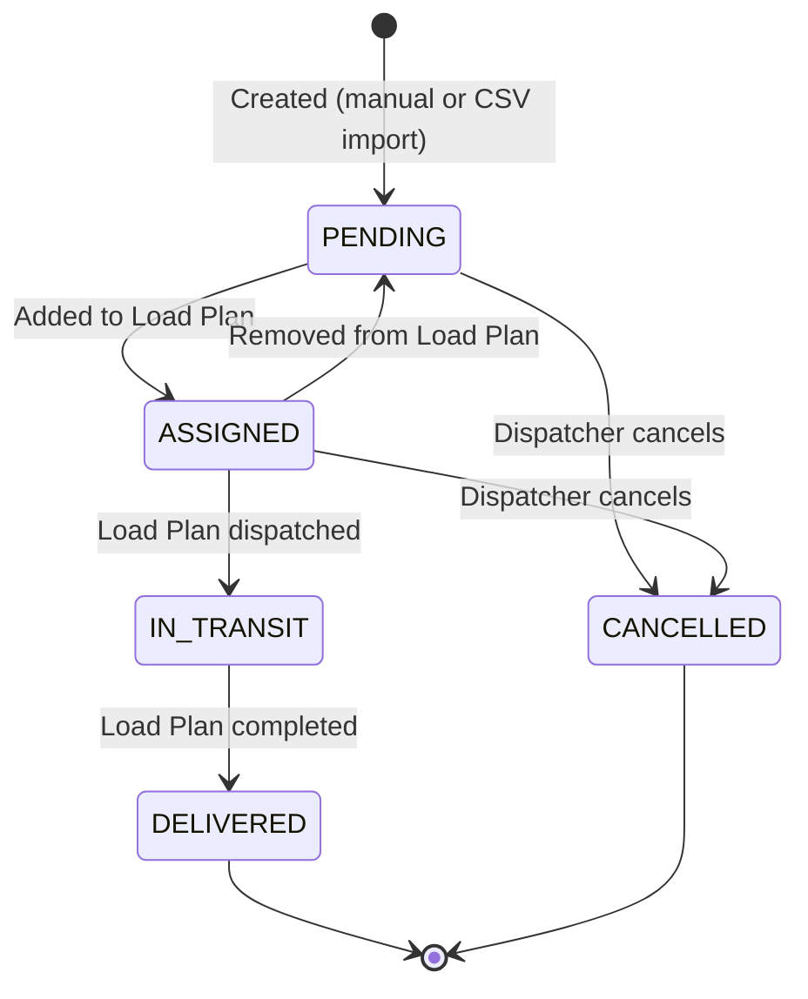
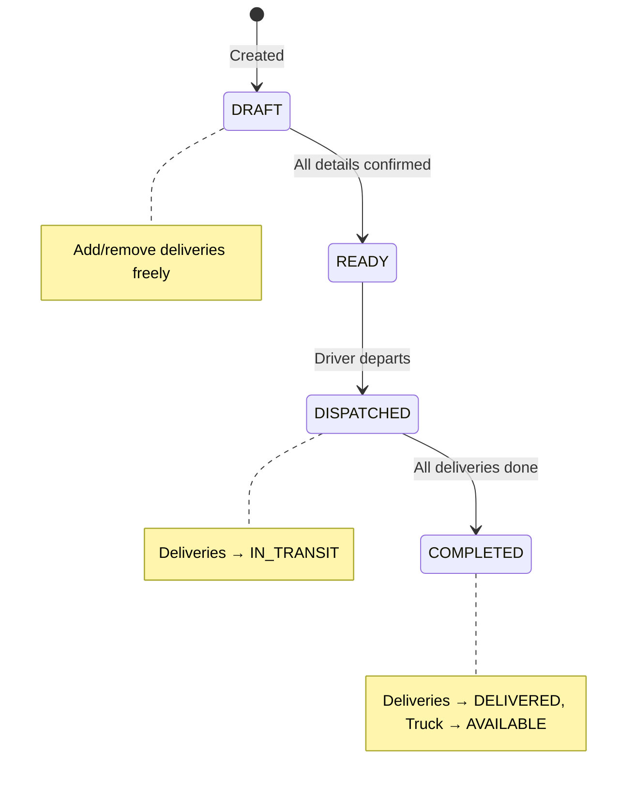
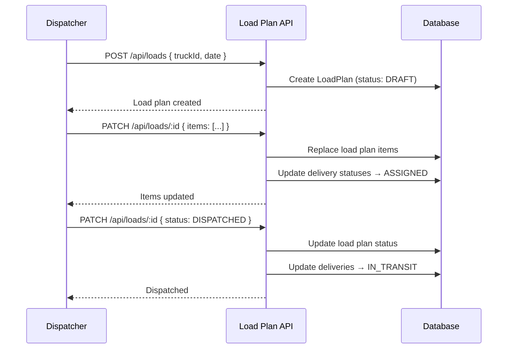
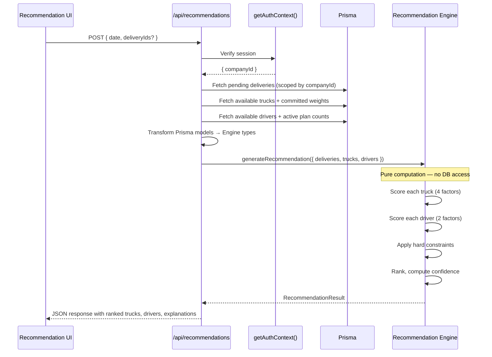
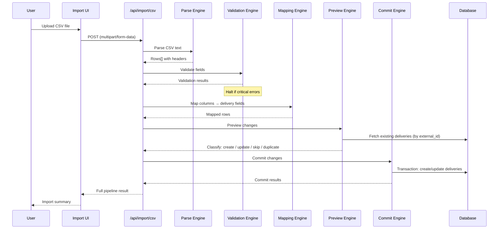
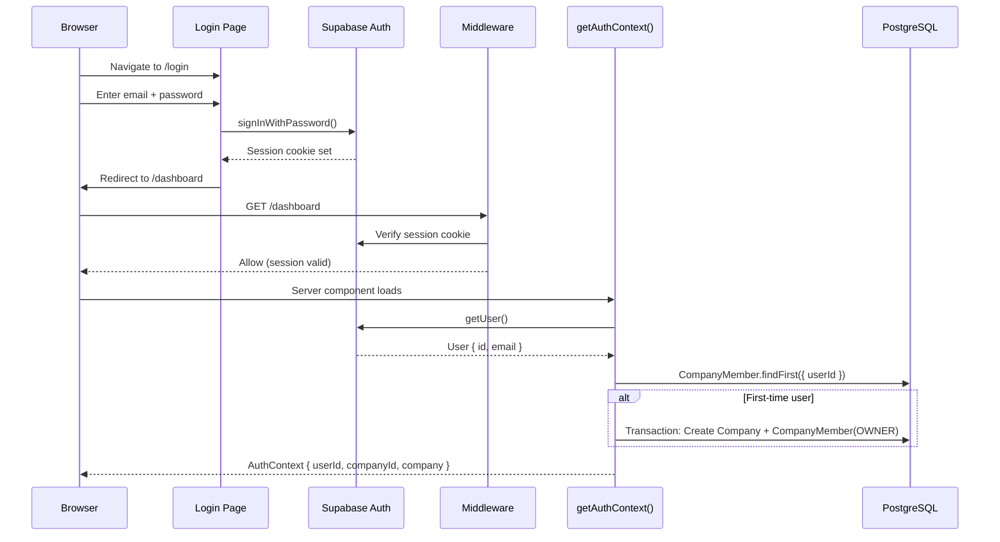
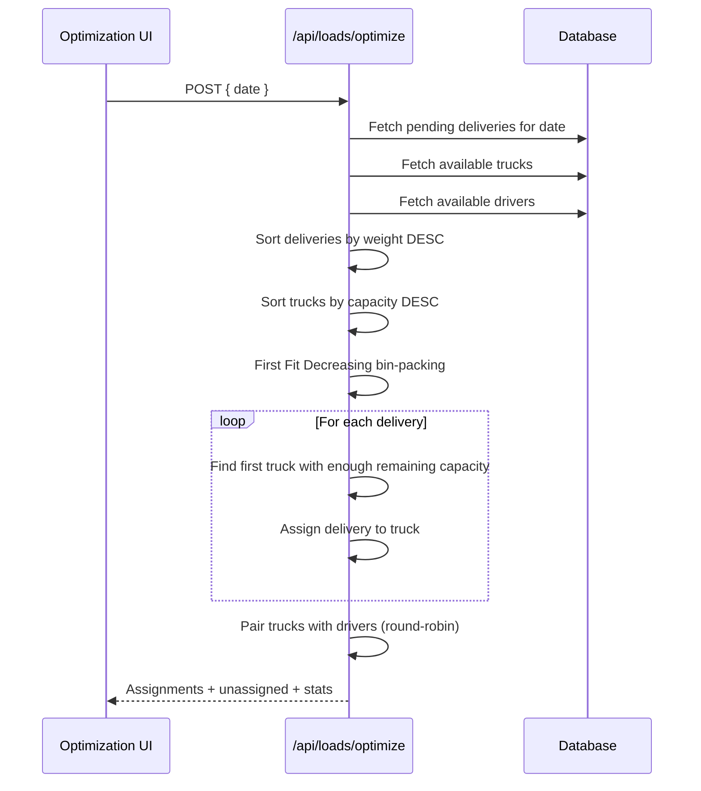

# System Workflows

## Delivery Lifecycle

### Key Rules
- `PENDING → ASSIGNED`: Automatic when delivery is added to a load plan via `PATCH /api/loads/:id`.
- `ASSIGNED → PENDING`: Automatic when delivery is removed from a load plan or plan is deleted.
- `IN_TRANSIT → DELIVERED`: Only via load plan completion (`PATCH /api/loads/:id` with `status: COMPLETED`).
- Direct status changes are limited to cancellation only. All other transitions go through the load plan workflow.
- Core fields cannot be edited once status is `IN_TRANSIT` or `DELIVERED`.

---

## Load Plan Lifecycle

### Side Effects by Status Transition

| Transition | Side Effect |
|-----------|-------------|
| `→ DRAFT` | No side effects |
| `→ READY` | No side effects |
| `→ DISPATCHED` | All assigned deliveries → `IN_TRANSIT` |
| `→ COMPLETED` | All assigned deliveries → `DELIVERED`, truck status → `AVAILABLE` |
| Load plan deleted | All assigned deliveries → `PENDING` |

---

## Truck Assignment Flow

---

## Recommendation Flow

### Scoring Factors

**Truck Scoring (70% of confidence):**
| Factor | Weight | Algorithm |
|--------|--------|-----------|
| Capacity Fit | 30% | Bell curve peaking at 80% utilization |
| Remaining Capacity | 15% | Normalized: `remainingCapacity / maxCapacity` |
| Availability | 15% | `AVAILABLE` = 1.0, `IN_USE` = 0.5, `MAINTENANCE` = excluded |
| Workload | 10% | Inverse: fewer active plans = higher score |

**Driver Scoring (30% of confidence):**
| Factor | Weight | Algorithm |
|--------|--------|-----------|
| Availability | 20% | `AVAILABLE` = 1.0, `ON_TRIP` = 0.4, `OFF_DUTY` = excluded |
| Workload | 10% | Inverse: fewer active plans = higher score |

---

## CSV Import Flow

### Import Pipeline Stages

1. **Parse** — Converts raw CSV text into structured row objects. Handles quoting, escaping, and header detection.
2. **Validate** — Checks required fields (`customerName`, `deliveryAddress`), data types, and value formats.
3. **Map** — Maps CSV column headers to delivery domain fields using fuzzy matching.
4. **Preview** — Compares mapped data against existing database records. Classifies each row as `create`, `update`, `no_change`, `skip`, or `duplicate`. Computes field-level diffs for updates.
5. **Commit** — Writes changes to the database inside a transaction. Supports rollback on failure. Creates `ImportRow` records for audit trail.

---

## Authentication Flow

### Auto-Provisioning

When a user signs up and accesses the dashboard for the first time:
1. `getAuthContext()` looks up `CompanyMember` by `userId`.
2. If no membership exists, it creates a new `Company` named `"{email prefix}'s Company"`.
3. It creates a `CompanyMember` with role `OWNER` in a single transaction.
4. The user immediately has a fully functional tenant with no manual setup.

---

## Route Optimization Flow

The optimizer uses the **First Fit Decreasing** algorithm: deliveries are sorted heaviest-first, and each is assigned to the first truck that has enough remaining capacity. This produces good utilization without exponential computation.

---

## Recommendation-to-Load-Plan Assignment Flow

`mermaid
sequenceDiagram
    participant D as Dispatcher
    participant UI as Recommendation UI
    participant RE as POST /api/recommendations
    participant AS as POST /api/recommendations/assign
    participant DB as Database

    D->>UI: Select target date
    D->>UI: Click "Generate Recommendation"
    UI->>RE: POST { date }
    RE->>DB: Fetch pending deliveries, trucks, drivers
    RE->>RE: Score & rank (deterministic engine)
    RE-->>UI: Ranked trucks, drivers, explanations

    D->>UI: Click "Create Load Plan"
    UI->>AS: POST { truckId, driverId, deliveryIds, date }

    AS->>AS: Authenticate (getAuthContext)
    AS->>AS: Validate UUIDs
    AS->>DB: Verify truck ownership + status
    AS->>DB: Verify driver ownership + status
    AS->>DB: Verify delivery ownership + eligibility
    AS->>DB: Check capacity fit
    AS->>DB: Check truck date conflict
    AS->>DB: Check driver date conflict

    alt Validation passes
        AS->>DB: BEGIN TRANSACTION
        AS->>DB: Create LoadPlan (DRAFT)
        AS->>DB: Create LoadPlanItems
        AS->>DB: Update deliveries PENDING ? ASSIGNED
        AS->>DB: COMMIT
        AS-->>UI: { success: true, loadPlan }
        UI-->>D: Success + link to Load Plan
    else Validation fails
        AS-->>UI: { error: "reason" }
        UI-->>D: Error toast with explanation
    end
`

### Delivery Status Transition

When a dispatcher accepts a recommendation:

- Deliveries transition from `PENDING` ? `ASSIGNED`
- This matches the existing manual assignment behavior in `PATCH /api/loads/[id]`
- Only `PENDING` deliveries are eligible for recommendation assignment
- `ASSIGNED`, `IN_TRANSIT`, `DELIVERED`, and `CANCELLED` deliveries are rejected

### Load Plan Status

The created Load Plan uses `DRAFT` status. This is consistent with the existing manual Load Plan creation flow and allows the dispatcher to review and modify the plan before dispatching.

### Transaction Safety

All database operations (create plan, create items, update delivery statuses) execute inside a single Prisma transaction. If any operation fails, the entire transaction rolls back with zero partial state.